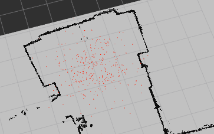
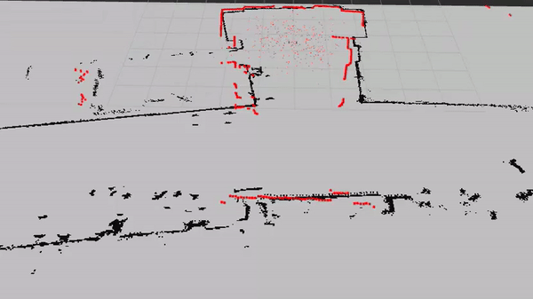
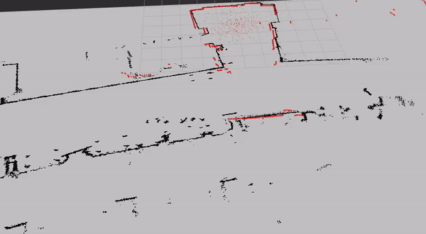
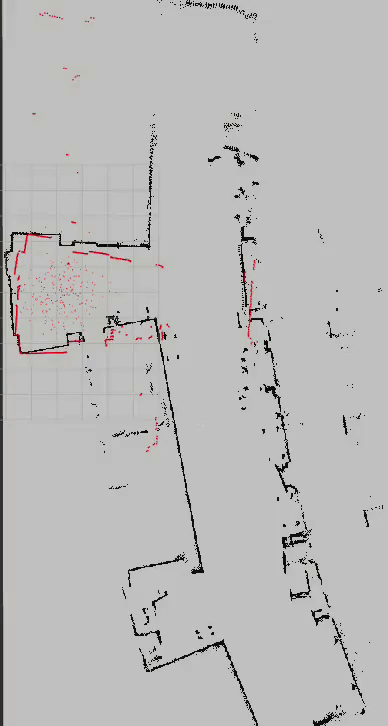
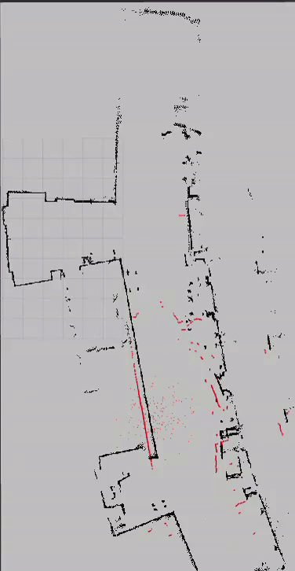
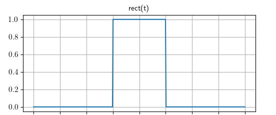
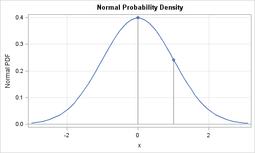
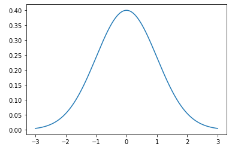

# Robot Localization

## Project Goal
Particle filters are an important method of localization that is used as a mainstream way to confidently keep track of where a robot is within an environment. The goal for this project was to implement our own particle filter algorithm to localize a robot within a premade map of the Academic Center at Olin. Utilizing the ROS platform and a neato’s odometry readings and lidar scans, we were able to successfully track the robots position using our particle filter.

## Implementation
To initialize our particles, we use a a wide normal distribution to distribute our particles around the estimated initial location of the robot. This initialization needs to be a broad distribution of particles because we do not know how accurate our initial measurement is. 

Figure 1.1

There are three major components to our particle filter, being able to update each particle based on the change in odometry, the lidar scan from the robot and resampling the particles. 

### Odometry Update
After initializing the particle cloud, the first major problem is to get the particles to move along with the robot. In order to achieve this, we can use the odometry measurements from the robot to update each particle. Given the old and new odometry, we are able to use matrix operations to get the change or delta in terms of a rotation translation matrix. We can then use those values to update each particle and have them move along with the particle.

Figure 1.2

It is clear that particles are moving in a somewhat similar way as the robot, but are moving farther and farther apart as time goes on, and the localization and mapping seem to be failing. In order, to solve this problem, we need to use another measurement to reweight and resample the particles. 

### Lidar Scan Update
Although the odometry update can help us determine how particles move through space, it does not tell us how to re-weight the particles based on how accurate they are. To do this we first can take the lidar scan, which is in the robot frame, and convert it to the world frame. Then, we check how close each point in the lidar scan is to an actual obstacle using an occupancy field. If it is below the threshold of 0.1, then we increment the weight for each particle by 1. What this allows us to do is weight each particle based on how close their projected lidar scan would be, to the actual map. 

#### Resampling
Once the weights are updated, we can resample the particles to get rid of particles that have a 0 or low weight and give preference to particles that have a higher probability of being accurate. To prevent the particles from collapsing and merging into one particle, in this step we also distribute each resampled particle along a tight normal distribution for both the translation and the theta. 

Figure 1.3

This is the implementation without the odometry update. It is clear that the particles are converging on a location, but because the particles are not moving with the robot it is still converging on the wrong location. 

## Final Product
Putting the two together gives us a particle filter with a good accuracy. Below are recordings of our particle filter in action, using a map of MAC 1st floor and of a classroom in the Academic Center. 
### MAC 1st Floor

#### Take 1

Figure 1.4

#### Take 2

Figure 1.5

## Major Design Decisions

### Lidar Scan Weight Update

Initially for our Lidar scan, to weigh the particles, we used a box function with a strict occupancy field cutoff. Initially if there were 5 or more particles close enough to an actual obstacle, then the particle weight goes to 1 and otherwise it is 0. Regardless of the threshold, this box function would eliminate or keep too many particles creating an innacurate particle filter.

Here is a visualization of our box filter.

Figure 2.1

Thus, we moved to a two step weight calculation. In the lidar scan function, we use the occupancy field calculation as a way to total how many obstacle scans in terms of the particle are close enough to an actual obstacle in the real world, and set that as the weight. Then the normalization step, normalizes them all to 1, meaning that particles with the most close scan points to an obstacle has the highest weight. This creates a more dynamic and more accurate particle filter. 

Here we can visualize the distribution of weights by using a PDF in figure 2.2. Claculating the probability that the particle is the actual location of the robot. The less the projected scan of a particle differs from the regular scan (the closer the difference is to 0) the higher that particle is weighted.

Figure 2.2

### Resampling Randomization for Particles
Another design decision we made was to prevent our particle from collapsing into one particle as time goes on by randomizing our particles in the resampling step. The resampling step resamples our distribution based on the updated weights. After recreating the particle filter, we apply a tight normal distribution around the particle to introduce variation that keeps the cloud from collapsing into 1 particle, improving accuracy of the filter in the long term. 

The model for this in figure 2.3 is also very similar to the model in figure 2.2 for weighing the particles. 

FIgure 2.3

## Number of Particles
We reduced the number of particles to 200 to allow the particles to stay closer to the robot when the filter is running. When the number is higher the particles significantly lag behind the robot model, causing a lot of the snapping of the map that we see in our recordings. To minimize this, while maintaining the accuracy of the filter, we reduced the number of particles to 200 to reduce how far behind the particles lag behind our robot. 

## Challenges

The biggest challenge we came across was applying the matrix transformations onto the particles. While in theory the application was simple, actually going through the code and grabbing the correct data was harder than expected. To solve this we first made sure that the math we had written in code was correct, by testing it with matrices which had outcomes we could expect. Then after that it was just reading documentation and dissecting the data types we were working with. We were able to figure out which parts of the data represented what aspects of the matrices we needed then apply that to the particles for the transformation. 

## Improvements

The best way to improve this particle filter would be to include more measurements in updating the weights of each particle. In its current state, the particle filter’s weights are determined based entirely on the lidar scan, which means that if the scan has increased error for any reason, the particle filter becomes highly inaccurate. 

Another way to improve the particle fitler is to improve the weighting changes to a more sophisticated calculation. We use a very rudimentary weight calculation, but there are more sophisticated methods of weighting the particles that could reduce the time it takes for the particle cloud to condense or improve the accuracy or efficiency of the particle filter.

The efficiency of the particle filter is also another optimization I would make in the future. Although the O notation is relatively low, a majority of the functions operate in O(n) other than the lidar scan update at O(n*m) and the resample function, there are still inefficiencies in our particle filter that most likely slow down our implementation significantly. Most likely the resampling function and the continous calculations we do are the biggest bottlenecks of our filter, and if we had more time we would verify that and work on improving the efficiency. 

## Lessons Learned

One big lesson learned is the differences in testing in the simulator as opposed to simulating using real data. Although all of the behaviour was very accurate in the simulator, a lot of the parameter tuning needed to be redone when running it on the bag files. In the future, we want to make sure that a majority of our parameter tuning isn't done using just the simulator and simulator data.

Another important lesson is scaffolding, testing and modularized code to reduce and make debugging easier and faster. When we encountered issues with our particle filter, specifically in the odometry and lidar scan updates, the structure of the code made it easier to identify and fix issues. In the future, we want to apply these code design principles to the later projects in this class and in our projects broadly. 